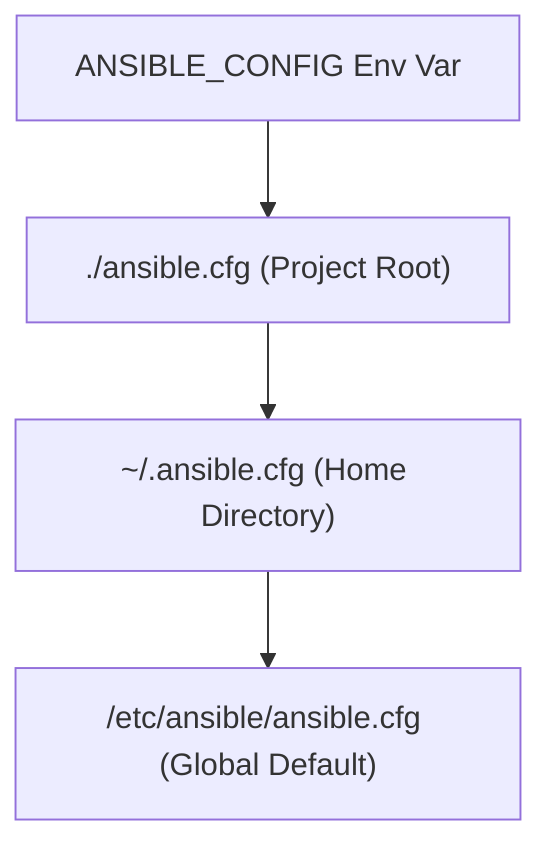

-06-21 19:22
Tags: #ansible 
##### Content

## Control Plane Architecture & Configuration Resolution

The Ansible control plane evaluates configuration parameters using a single-point-of-failure resolution cascade. It processes options in a strict, non-merging sequence and applies **only the first file** it encounters.



### Production Configuration Specification

```ini
# ./ansible.cfg

[defaults]
# Defines the default inventory location relative to the project root
inventory = ./inventory.yml

# Specifies the default remote user to log into managed nodes
remote_user = devops

# Disables SSH host key validation to skip manual host confirmation prompts
host_key_checking = False

# Sets the maximum number of concurrent processes spawned for host execution
forks = 10

# Configures the fact gathering policy (smart gathers only if not already cached)
gathering = smart

# Configures the storage backend module for persistence of gathered host facts
fact_caching = jsonfile

# Defines the specific local filesystem path to store the JSON fact cache files
fact_caching_connection = /tmp/ansible_fact_cache

# Establishes the cache expiration threshold window measured in seconds
fact_caching_timeout = 7200

# Overrides the default stdout display plugin to output in a clean YAML layout
stdout_callback = yaml

# Extends the logging framework by enabling callback tracking modules
callbacks_enabled = timer, profile_tasks

[privilege_escalation]
# Automatically forces privilege escalation execution across all playbooks
become = True

# Instructs the escalation subsystem to use the sudo binary on the target
become_method = sudo

# Specifies that the escalated execution context must switch to the root user
become_user = root

# Disables the password challenge prompt during runtime privilege escalation
become_ask_pass = False

[ssh_connection]
# Enables direct execution via stdin to bypass SFTP filesystem operations
pipelining = True

# Passes optimization arguments directly to the underlying OpenSSH client binary
ssh_args = -o ControlMaster=auto -o ControlPersist=60s

```

> **Execution Engine Insight:** Enabling `pipelining = True` bypasses the standard execution model where Ansible copies distinct Python scripts to the remote node's temporary filesystem via SFTP/SCP. Instead, it executes the module code directly over the existing SSH socket stdin stream. This eliminates significant filesystem I/O on managed nodes but requires the `requiretty` directive to be disabled inside target `/etc/sudoers` files to avoid immediate execution failures during privilege escalation.

## Inventory Design & Variable Precedence

### Directory Layout Hierarchy

To scale variable management within complex multi-environment infrastructures, variables must be extracted out of the raw text inventory files and isolated within strict directory structural domains matching group and host namespace contexts.

```text
├── inventory.yml
├── group_vars/
│   ├── all.yml          # Variables evaluated by every managed node
│   └── webservers.yml   # Variables evaluated strictly by nodes in the [webservers] group
└── host_vars/
    └── db-01.yml        # Fine-grained overrides mapping to a distinct inventory hostname

```

### Compilation Precedence Hierarchy

When identical variables are declared across multiple layers, Ansible resolves the true compilation state using a strict priority ranking.

| Rank          | Context Source      | CLI Syntax / Declaration Location                                      | Overridability     |
| ------------- | ------------------- | ---------------------------------------------------------------------- | ------------------ |
| `1 (Highest)` | Extra Vars          | `ansible-playbook -e "app_version=2.4.1"`                              | Immutable          |
| `2`           | Interactive Prompts | Declared under the `vars_prompt:` play directive                       | Local Scope        |
| `3`           | Task Vars           | Defined directly inside a specific task block (`vars:`)                | Local Task Scope   |
| `4`           | Block Vars          | Defined inside a `block:` configuration unit                           | Local Block Scope  |
| `5`           | Play Vars           | Declared at the root of a play definition (`vars:`, `vars_files:`)     | Play Scope         |
| `6`           | Host Vars           | Extracted dynamically from the `host_vars/` directory                  | Host Specific      |
| `7`           | Group Vars          | Extracted dynamically from the `group_vars/` directory                 | Group Specific     |
| `8`           | Inventory Vars      | Declared inline inside the raw inventory text file                     | Global / Group     |
| `9 (Lowest)`  | Role Defaults       | Defined inside a structured role profile (`roles/x/defaults/main.yml`) | Highly Overridable |

### Privilege Escalation (`become`) Execution Resolution

The true administrative escalation state on a target node is determined at runtime using the following execution priority:

1. **Command Line Flags:** `ansible-playbook --become --become-user=root` *(Highest Priority)*
2. **Playbook/Task Keywords:** `become: true` defined at the play or discrete task level.
3. **Inventory / Group Variables:** Target execution parameters defined via `ansible_become=yes`.
4. **Configuration File Engine Defaults:** The global parameters fallback configuration managed in `ansible.cfg`.

##### References
