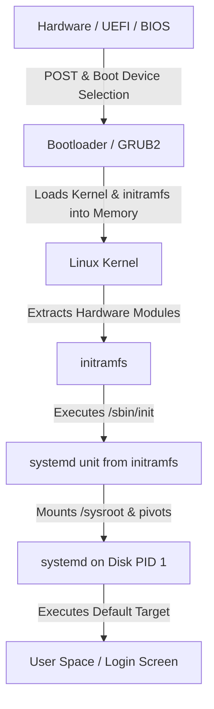

2026-06-19 16:35
Tags: #linux #redhat 
##### Content

## Boot Architecture Topology

## Core Execution Phases

1. **Bootloader Handoff:** GRUB2 loads the compressed Linux kernel (`vmlinuz`) and the `initramfs` (Initial RAM File System) into memory, passing kernel command-line parameters.
2. **Kernel Initialization:** The kernel unpacks itself, probes underlying hardware, and loads necessary storage/storage-controller drivers from the `initramfs`.
3. **initramfs User Space:** The kernel executes `/sbin/init` from the `initramfs`. In modern RHEL, this is a symlink to a temporary, RAM-based `systemd` instance.
4. **Root Pivot:** The temporary `systemd` mounts the actual physical root file system (defined in `/etc/fstab`) to `/sysroot`. The kernel then dynamically swaps the root directory from the RAM disk to the physical disk.
5. **Systemd Takeover:** The temporary `systemd` re-executes the persistent `/usr/lib/systemd/systemd` binary from the physical disk, inheriting PID 1, and begins processing unit dependencies to reach the default target.

> **Note:** The root pivot operation relies on the kernel's `pivot_root` or `switch_root` syscalls. By moving the physical mount to `/` and purging the `initramfs` from memory, the kernel entirely avoids file descriptor conflicts during the transition. If this fails (usually due to a missing storage driver or corrupted LVM/LUKS setup), the boot panics and drops into a `dracut` emergency shell.

## Boot Loader & initramfs Tooling

* **`grubby`:** RHEL-specific CLI tool used to update, display, and modify GRUB menu entries and kernel arguments persistently without requiring a full `grub2-mkconfig` rebuild.
* **`dracut`:** The default RHEL utility for generating the `initramfs` archive. It uses an event-driven framework (`udev`) to aggressively detect hardware and bundle only the strictly required kernel modules, minimizing boot payload size. Use `lsinitrd` to inspect the contents of a dracut-built image.
* **`mkinitcpio`:** An alternative initialization generation tool (standard on Arch Linux) that relies on bash scripts rather than an event-driven model. It sequentially reads a static array of required hooks to build the RAM disk.
##### References
