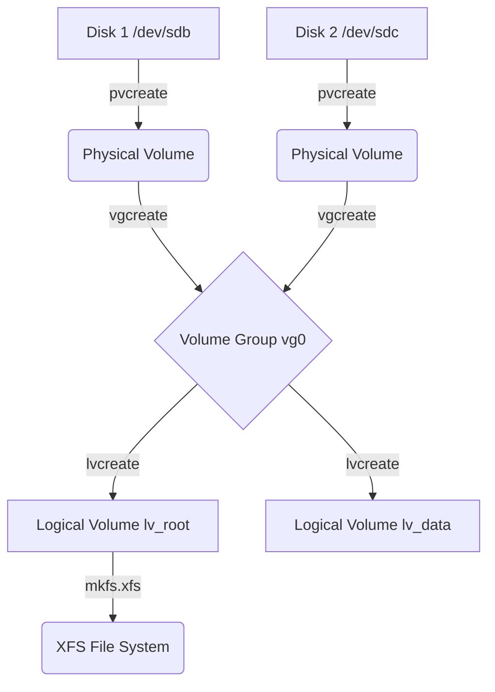

2026-06-18 14:23
Tags: #linux #redhat 
##### Content

## Disk Partitioning

Direct block device manipulation requires instructing the kernel to read partition table modifications.

* **`parted`:** Modern partitioning utility supporting both MBR and GPT.
```bash
parted /dev/sdb mklabel gpt
parted /dev/sdb mkpart primary xfs 1MiB 10GiB

```

* **`fdisk`:** Legacy partitioner. Sizing via `+10G` allocates from the current sector boundary, `-10G` leaves the last 10G unallocated.
* **Kernel Sync Binaries:** `partprobe` (forces kernel to reread tables) and `udevadm` (controls `systemd-udevd` to generate `/dev` nodes).

## File System Mounting & Persistence

`/etc/fstab` dictates static mount resolution at boot. An invalid block device configuration here induces kernel panic/emergency mode at boot.

```
UUID=0a3407de-014b... /       ext4   defaults        0      1
UUID=b411dc99-f0a0... /home   ext4   defaults        0      2
UUID=f9fe0b69-a280... swap    swap   defaults        0      0
```

| Field 1                | Field 2         | Field 3     | Field 4            | Field 5  | Field 6              |
| ---------------------- | --------------- | ----------- | ------------------ | -------- | -------------------- |
| **Device**             | **Mount Point** | **FS Type** | **Options**        | **Dump** | **fsck Order**       |
| `UUID=a806...`         | `/`             | `xfs`       | `defaults`         | `0`      | `0` (XFS skips fsck) |
| `/dev/vg0/lv_data`<br> | `/dbdata`       | `ext4`      | `defaults,noatime` | `0`      | `2` (Secondary fsck) |

## MBR Manipulation

Master Boot Record (first 512 bytes of the disk) backups rely on raw `dd` byte copying.

```bash
# Backup MBR
dd if=/dev/sdb of=/mbr_backup bs=512 count=1

# Nuke MBR (Zero out)
dd if=/dev/zero of=/dev/sdb bs=512 count=1

# Restore
dd if=/mbr_backup of=/dev/sdb bs=512 count=1

```

## Logical Volume Management (LVM)

Abstracts physical storage limits, allowing live resizing and data migration across physical disks.



**Core Execution Paths:**

```bash
# 1. Initialize Physical Volumes (No underlying partition required)
pvcreate /dev/sdb /dev/sdc

# 2. Pool PVs into a Volume Group
vgcreate vg_data /dev/sdb /dev/sdc

# 3. Carve out a Logical Volume (Use -L for static size, -l for extents)
lvcreate -n lv_postgres -L 50G vg_data

# 4. Live Extension (Resize LV and underlying File System simultaneously)
lvextend -r -L +10G /dev/vg_data/lv_postgres

# 5. Live PV Migration (Evacuate blocks from a failing disk to free disks in VG)
pvmove -A y /dev/sdb # -A to backup metadata

```

> [!warning] Warning
> Shrinking (`lvreduce`) is highly destructive and unsupported by XFS. To reduce an `ext4` LV, the file system must be forcibly unmounted, `e2fsck` validated, and the file system shrunk via `resize2fs` *before* the LV boundary is reduced. Failure to sequence this correctly results in immediate superblock corruption.

##### References
