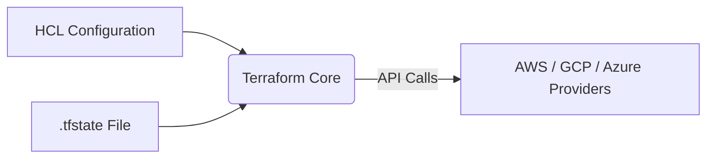

2026-06-28 16:00
Tags: #terraform 
##### Content

## The Provisioning Engine

Terraform relies on a declarative model. You define the *desired* end state in configuration files, and the Terraform Core engine compares this against the *actual* state mapped in the state file.

## Command Lifecycle

* **`terraform init`:** Bootstraps the working directory. It downloads provider binaries from the Terraform Registry into the `.terraform` directory and generates the `.terraform.lock.hcl` lockfile (similar to `Cargo.lock` or `package-lock.json`) to pin dependency versions. It also pulls remote module code.
* **`terraform plan`:** Computes the differential (diff) between the local configuration and the current state tracking, outputting the exact actions (create, update, destroy) required to achieve the desired state.
* **`terraform apply`:** Executes the API calls defined in the execution plan against the cloud provider.
* **`terraform destroy`:** Instructs the provider API to tear down every resource currently tracked in the state file.

##### References
